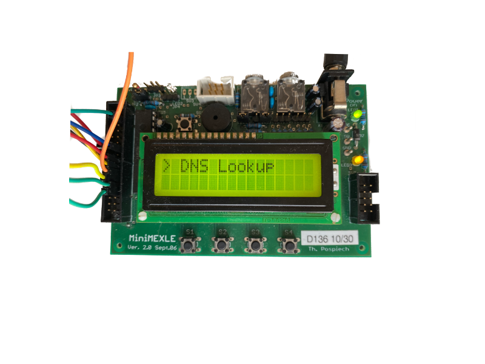
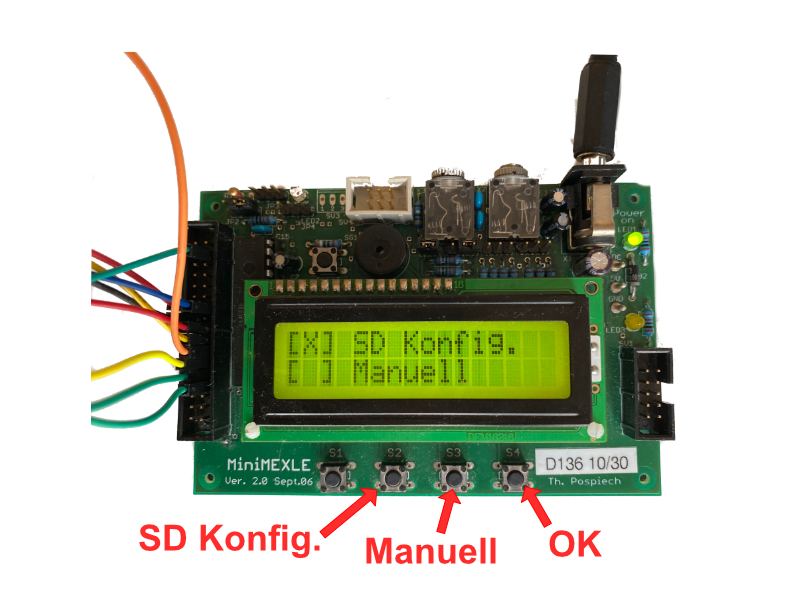
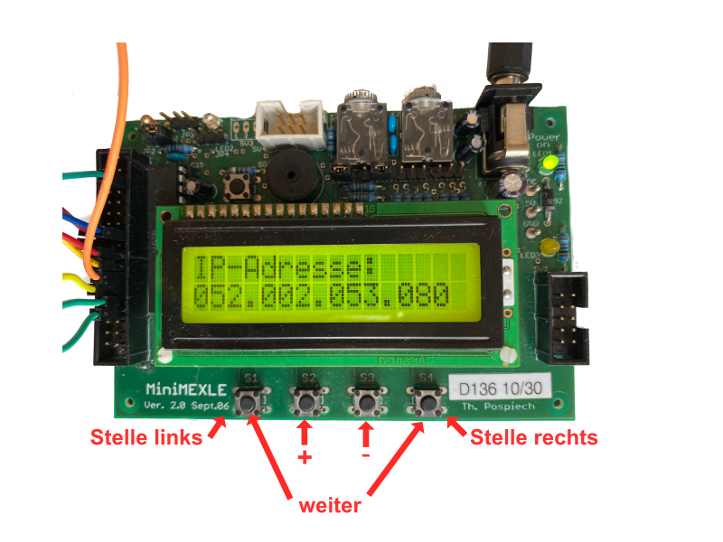
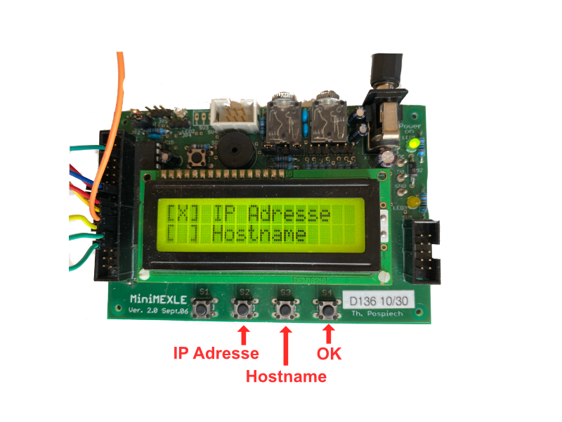
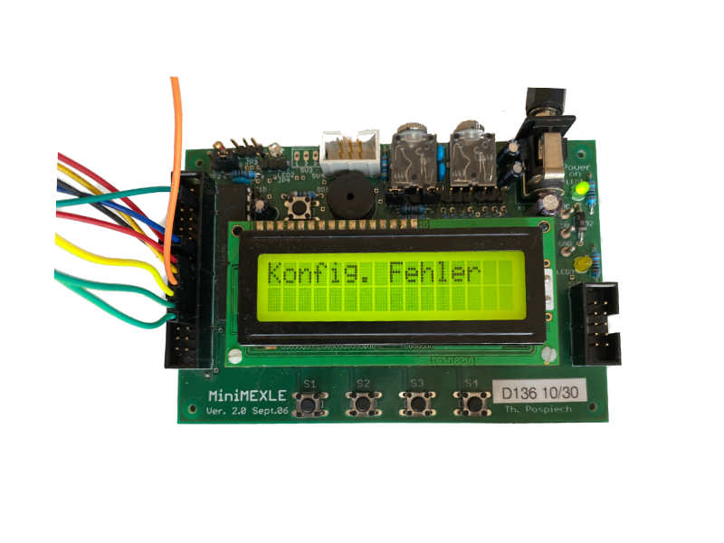
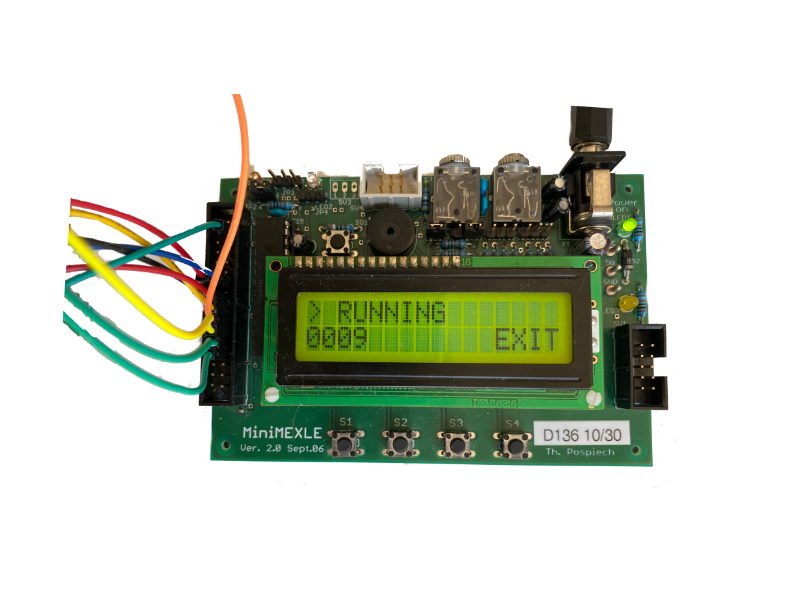
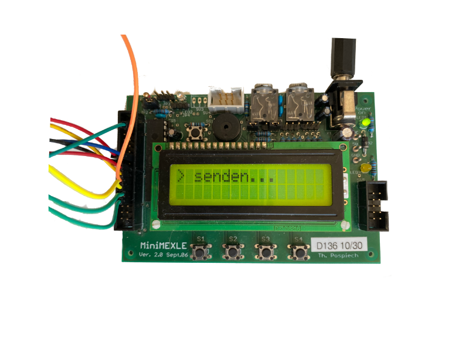
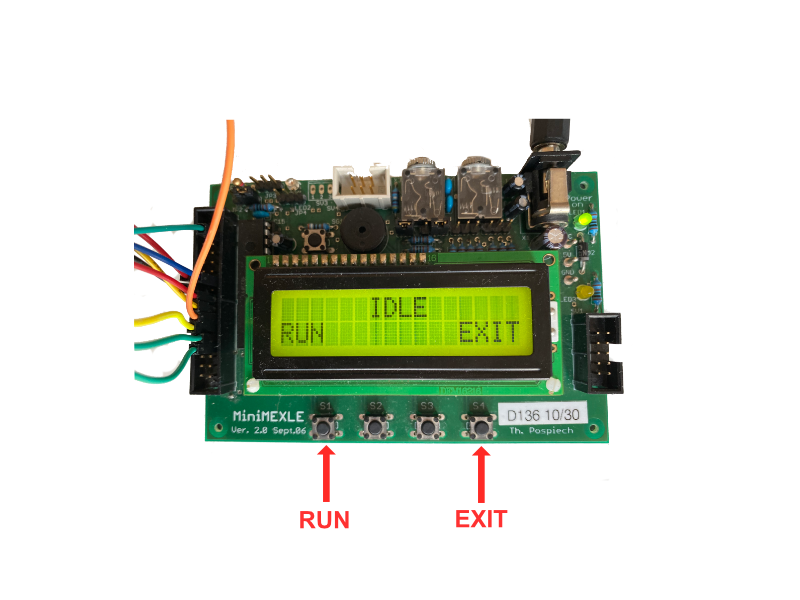
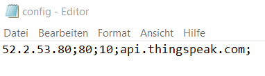

# Ethernet Data logger

Software design of a microcontroller based data logger for analog measurements and data transmission to web services like thingspeak via Ethernet.

# The idea

- Reading analog sensors in freely configurable time intervals.
- Data transmission via Ethernet to an external data server.
- Configuration via SD card or LCD.

## Components

- [SPI SD Modul](https://www.az-delivery.de/products/copy-of-spi-reader-micro-speicherkartenmodul-fur-arduino)
- [Ethernet Modul mit ENC28J60](https://www.az-delivery.de/products/enc28j60-netzwerkmodul)
- Analog sensor or potentiometer for simulation
- LCD Display
- Atmega328P

## Software design

The aim was to be as independent as possbile of hardware and also to have a modular structure. For this purpose, the software project was divided into several chapters. The following directories are located in the project folder:

- **libs** libraries user for hardware communication.
- **routines** contain the 'logic' of the datalogger.
- **views** contain all LCD and user interaction code.

### The Ethernet library

Es wurde auf eine bereits fertige Bibliothek für den Ethernet Controller ENC28J60 genutzt. Es wurde ein übergeordneter wrapper entwickelt, der übergeordnete Funktionen zur Netzwerkkonfiguration und zum Senden von Datenpaketen bereitstellt.

### The SD card library

The developement of the SD card library is based on the specification documentation of the SD card foundation. The corresponding document is located [here](https://www.sdcard.org/downloads/pls/pdf/index.php?p=Part1_Physical_Layer_Simplified_Specification_Ver7.10.jpg&f=Part1_Physical_Layer_Simplified_Specification_Ver7.10.pdf&e=EN_SS1). This project implements a FAT32 format type.

### Software documentation

Details about the software can be found in the documentation, that was created with Doxygen, located in the repository under the docs folder.

## Open points / possible extensions

- Message Queue
- UTC timestamp
- Configuration via Ethernet (with web interface)

# Impressions

